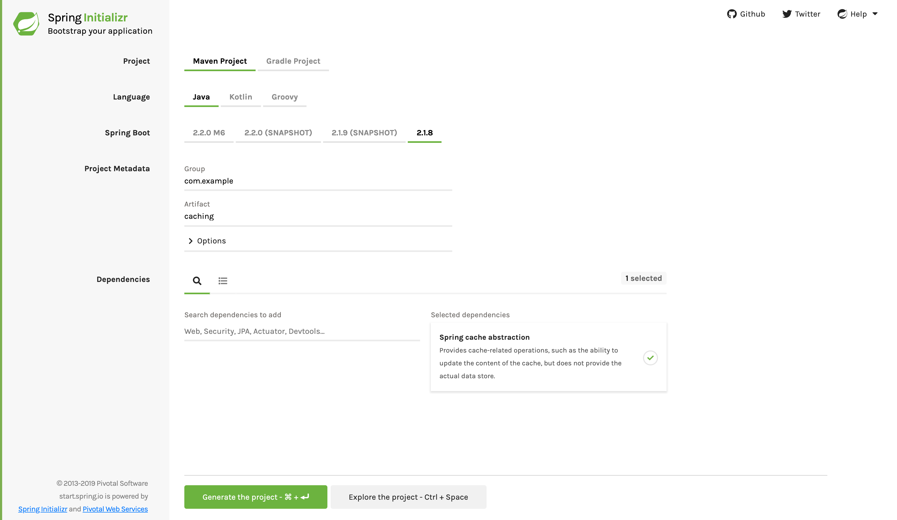

:spring_version: current
:spring_boot_version: 2.2.2.RELEASE
:SpringData: https://projects.spring.io/spring-data/
:Cacheable: https://docs.spring.io/spring/docs/current/javadoc-api/org/springframework/cache/annotation/Cacheable.html
:CachePut: https://docs.spring.io/spring/docs/current/javadoc-api/org/springframework/cache/annotation/CachePut.html
:CacheEvict: https://docs.spring.io/spring/docs/current/javadoc-api/org/springframework/cache/annotation/CacheEvict.html
:CachingConfigurer: https://docs.spring.io/spring/docs/{spring_version}/javadoc-api/org/springframework/cache/annotation/CachingConfigurer.html
:EnableCaching: https://docs.spring.io/spring/docs/{spring_version}/javadoc-api/org/springframework/cache/annotation/EnableCaching.html
:CacheManager: https://docs.spring.io/spring/docs/{spring_version}/javadoc-api/org/springframework/cache/CacheManager.html
:documentation: https://docs.spring.io/spring/docs/current/spring-framework-reference/html/cache.html
:bootcaching: https://docs.spring.io/spring-boot/docs/current/reference/html/boot-features-caching.html
:runner: https://docs.spring.io/spring-boot/docs/current/reference/htmlsingle/#boot-features-command-line-runner
:toc:
:icons: font
:source-highlighter: prettify
:project_id: gs-caching

This guide walks you through the process of enabling caching on a Spring managed bean.

== What You Will build

You will build an application that enables caching on a simple book repository.

== What You need

:java_version: 1.8
include::https://raw.githubusercontent.com/spring-guides/getting-started-macros/master/prereq_editor_jdk_buildtools.adoc[]

include::https://raw.githubusercontent.com/spring-guides/getting-started-macros/master/how_to_complete_this_guide.adoc[]

[[scratch]]
== Starting with Spring Initializr

For all Spring applications, you should start with the https://start.spring.io[Spring
Initializr]. The Initializr offers a fast way to pull in all the dependencies you need for
an application and does a lot of the set up for you. This example needs only the Spring
cache abstraction dependency. The following image shows the Initializr set up for this
sample project:

NOTE: The preceding image shows the Initializr with Maven chosen as the build tool. You
can also use Gradle. It also shows values of `com.example` and
`caching` as the Group and Artifact, respectively. You will use those values throughout
the rest of this sample.

The following listing shows the `pom.xml` file created when you choose Maven:

====
[src,xml]
----
include::complete/pom.xml[]
----
====

The following listing shows the `build.gradle` file created when you choose Gradle:

====
[src,groovy]
----
include::complete/build.gradle[]
----
====

[[initial]]
== Create a Book Repository

First, you need to create a simple model for your book. The following listing (from
`src/main/java/com/example/caching/Book.java`) shows how to do so:

====
[source,java,tabsize=2]
----
include::initial/src/main/java/com/example/caching/Book.java[]
----
====

You also need a repository for that model. The following listing (from
`src/main/java/com/example/caching/BookRepository.java`) shows such a repository:

====
[source,java,tabsize=2]
----
include::initial/src/main/java/com/example/caching/BookRepository.java[]
----
====

You could have used {SpringData}[Spring Data] to provide an implementation of your
repository over a wide range of SQL or NoSQL stores. However, for the purpose of this
guide, you will simply use a naive implementation that simulates some latency
(network service, slow delay, or other issues). The following listing (from
`src/main/java/com/example/caching/SimpleBookRepository.java`) shows such a repository:

====
[source,java,tabsize=2]
----
include::initial/src/main/java/com/example/caching/SimpleBookRepository.java[]
----
====

`simulateSlowService` deliberately inserts a three-second delay into each `getByIsbn`
call. Later on, you will speed up this example with caching.

== Using the Repository

Next, you need to wire up the repository and use it to access some books. The following
listing (from `src/main/java/com/example/caching/CachingApplication.java`) shows how to do
so:

====
[source,java,tabsize=2]
----
include::initial/src/main/java/com/example/caching/CachingApplication.java[]
----
====

include::https://raw.githubusercontent.com/spring-guides/getting-started-macros/master/spring-boot-application-new-path.adoc[]

You also need a {runner}[`CommandLineRunner`] that injects the `BookRepository` and calls
it several times with different arguments. The following listing (from
`src/main/java/com/example/caching/AppRunner.java`) shows that class:

====
[source,java,tabsize=2]
----
include::complete/src/main/java/com/example/caching/AppRunner.java[]
----
====

If you try to run the application at this point, you should notice that it is quite slow,
even though you are retrieving the exact same book several times. The following sample
output shows the three-second delay that our (intentionally awful) code created:

====
----
2014-06-05 12:15:35.783  ... : .... Fetching books
2014-06-05 12:15:40.783  ... : isbn-1234 -->Book{isbn='isbn-1234', title='Some book'}
2014-06-05 12:15:43.784  ... : isbn-1234 -->Book{isbn='isbn-1234', title='Some book'}
2014-06-05 12:15:46.786  ... : isbn-1234 -->Book{isbn='isbn-1234', title='Some book'}
----
====

We can improve the situation by enabling caching.

== Enable caching

Now you can enable caching on your `SimpleBookRepository` so that the books are cached
within the `books` cache. The following listing (from
`src/main/java/com/example/caching/SimpleBookRepository.java`) shows the repository
definition:

====
[source,java,tabsize=2]
----
include::complete/src/main/java/com/example/caching/SimpleBookRepository.java[]
----
====

You now need to enable the processing of the caching annotations, as the following example
(from `src/main/java/com/example/caching/CachingApplication.java`) shows how to do:

====
[source,java,tabsize=2]
----
include::complete/src/main/java/com/example/caching/CachingApplication.java[]
----
====

The {EnableCaching}[`@EnableCaching`] annotation triggers a post-processor that
inspects every Spring bean for the presence of caching annotations on public
methods. If such an annotation is found, a proxy is automatically created to intercept
the method call and handle the caching behavior accordingly.

The post-processor handles the  {Cacheable}[`@Cacheable`], {CachePut}[`@CachePut`] and
{CacheEvict}[`@CacheEvict`] annotations. You can refer to the Javadoc and
{documentation}[the reference guide] for more detail.

Spring Boot automatically configures a suitable {CacheManager}[`CacheManager`] to serve as
a provider for the relevant cache. See {bootcaching}[the Spring Boot documentation] for
more detail.

Our sample does not use a specific caching library, so our cache store is the simple
fallback that uses `ConcurrentHashMap`. The caching abstraction supports a wide range of
cache libraries and is fully compliant with JSR-107 (JCache).

include::https://raw.githubusercontent.com/spring-guides/getting-started-macros/master/build_an_executable_jar_subhead.adoc[]

include::https://raw.githubusercontent.com/spring-guides/getting-started-macros/master/build_an_executable_jar_with_both.adoc[]

== Test the Application

Now that caching is enabled, you can run the application again and see the difference by
adding additional calls with or without the same ISBN. It should make a huge difference.
The following listing shows the output with caching enabled:

====
----
2016-09-01 11:12:47.033  .. : .... Fetching books
2016-09-01 11:12:50.039  .. : isbn-1234 -->Book{isbn='isbn-1234', title='Some book'}
2016-09-01 11:12:53.044  .. : isbn-4567 -->Book{isbn='isbn-4567', title='Some book'}
2016-09-01 11:12:53.045  .. : isbn-1234 -->Book{isbn='isbn-1234', title='Some book'}
2016-09-01 11:12:53.045  .. : isbn-4567 -->Book{isbn='isbn-4567', title='Some book'}
2016-09-01 11:12:53.045  .. : isbn-1234 -->Book{isbn='isbn-1234', title='Some book'}
2016-09-01 11:12:53.045  .. : isbn-1234 -->Book{isbn='isbn-1234', title='Some book'}
----
====

In the preceding sample output, the first retrieval of a book still takes three seconds.
However, the second and subsequent times for the same book are much faster, showing that
the cache is doing its job.

== Summary

Congratulations! You've just enabled caching on a Spring managed bean.

== See Also

The following guides may also be helpful:

* https://spring.io/guides/gs/caching-gemfire/[Caching Data with Gemfire]
* https://spring.io/guides/gs/serving-web-content/[Serving Web Content with Spring MVC]
* https://spring.io/guides/gs/spring-boot/[Building an Application with Spring Boot]

include::https://raw.githubusercontent.com/spring-guides/getting-started-macros/master/footer.adoc[]
